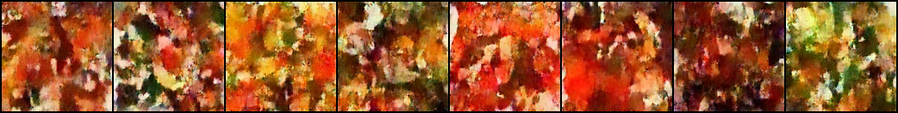
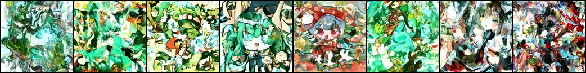
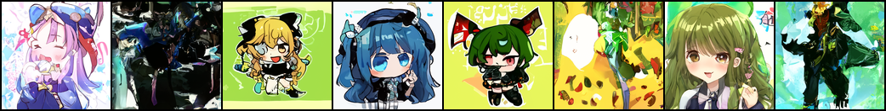
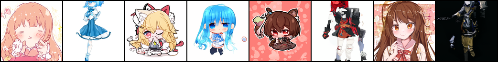
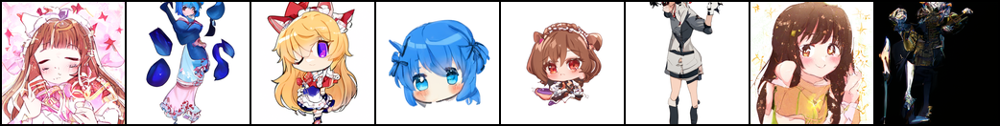
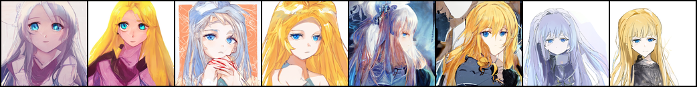
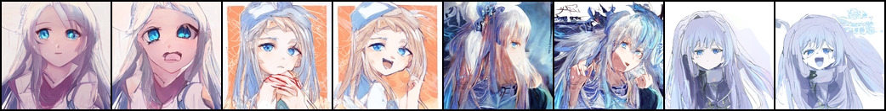
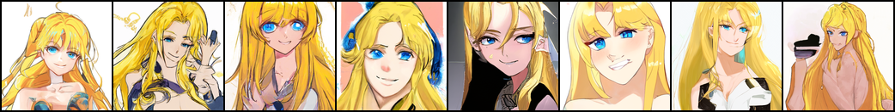

# TEXTOON 
## Attribute-Conditioned Character Generation

A conditional Denoising Diffusion Probabilistic Model (DDPM) that generates
anime characters from a 91-dimensional multi-hot attribute vector. Trained
on ~46k Safebooru images at both 64×64 and 128×128 resolution with classifier-free
guidance.

## Architecture

 UNet (~18M params) from `denoisingdiffusionpytorch`, subclassed to inject
  attribute conditioning.
 91dim attribute vector → 2layer MLP → added to time embedding before AdaGN
  injection in residual blocks.
 Classifierfree guidance: 10% attribute dropout during training; guidance
  scale 5.0 at sampling.
 Cosine noise schedule, 1000 timesteps, ε prediction objective.
  EMA of model weights (decay 0.9999, warmup at step 1000); samples drawn from EMA.

| Run | Resolution | Steps | Batch | Wall time | Samples used |
|-----------|---------|------|-----|--------------|----------|
| `run_64`  | 64×64   | 400k | 256 | ~11h on H100 | baseline |
| `run_128` | 128×128 | 150k | 64  | ~17h on H100 | final    |

Optimizer: AdamW lr=2e-4 (cosine decay), bfloat16 mixed precision.

## Results

The project trained two models: an initial 64×64 baseline (400k steps) and a
final 128×128 model (150k steps) trained at higher resolution after observing
that some attributes the 64 model could not control were limited by pixel
footprint, and also because 128 is just more cool.

*128x128 Training Samples:*
 Step 5K
 Step 30K
 Step 60K
 Step 100K
 Step 150K


*Final 128×128 model: attribute toggling under fixed noise. Each image toggles
one attribute OFF (left) / ON (right) for 4 different characters.*
Blonde Hair:

Blush:

Open Mouth:

Twin Tails (pony?):


*Noisespace interpolation with attributes held fixed. Conditioning is preserved
across the full noise trajectory. The following attributes fixed over the noise cycle- 
["1girl", "long_hair", "blonde_hair", "smile", "blue_eyes"]:*



## The 64 to 128 Journey

The project initially shipped a 64×64 model on the (correct) reasoning that
48k images is light for pixelspace diffusion at higher resolution. Evaluation
on the 64 model revealed that some large attributes (ex. hair color) toggled
well, while others (ex. mouth state) only partially worked.

The hypothesis is that attributes failing at 64 were limited by pixel footprint,
a smile occupies maybe 30 pixels at 64×64 vs 120 at 128×128. Doubling resolution
should help shapebased attributes while keeping colorbased attributes same.

The 128 model seems to suggest this: every attribute that worked at 64 still works at
128, and several that were ambiguous at 64 are now very clear.


## Installation

```bash
git clone <repo>
cd <repo>
conda create -n ddpm python=3.11 -y
conda activate ddpm
pip install torch==2.4.1 torchvision==0.19.1 --index-url https://download.pytorch.org/whl/cu121
pip install -r requirements.txt
```

## Run

The dataset is not bundled (~2.4GB at 128×128). The acquisition pipeline is in
`scraper.py` + `prep_data.py`; output is one HDF5 file plus a metadata CSV.

```bash
# 1. Scrape and prep
python scraper.py
python prep_data.py --base_dir <path>      # 64×64 HDF5
python prep_128.py --base_dir <path>       # 128×128 HDF5

# 2. Train/val split
python make_split.py

# 3. Train (Slurm wrappers in train.sbatch / train_128.sbatch)
python train.py        # 64×64
python train_128.py    # 128×128

# 4. Evaluate
python eval_toggle.py        # or eval_toggle_128.py
python eval_interp.py        # or eval_interp_128.py
python eval_compare.py       # side-by-side comparison
```

## Extra Criteria

**Latent Space Exploration.** Implemented two latent-space experiments:

- **Attribute toggling:** Hold input noise fixed, toggle individual attributes
  on/off, measure visual disentanglement.
- **Noise interpolation:** Hold attributes fixed, interpolate noise between two
  seeds across 8 frames, assess latent continuity.

Findings hold across both resolutions: conditioning is preserved under
noise interpolation; toggle disentanglement is partial and improves with
resolution.


## Repository Structure

```
.
├── scraper.py              # Safebooru scraper (multi-threaded, deduplicated)
├── prep_data.py            # 64×64 HDF5
├── prep_128.py             # 128×128 HDF5
├── dataset.py              # PyTorch Dataset (HDF5-backed, lazy worker init)
├── make_split.py           # Stratified 95/5 train/val split
├── model.py                # AttrConditionedUnet + AttrGaussianDiffusion + CFG sampler
├── train.py / train_128.py # Training loops
├── train.sbatch            # Slurm submission scripts
├── eval_toggle*.py         # Attribute toggling experiment
├── eval_interp*.py         # Noise interpolation experiment
├── eval_compare.py         # 64 vs 128 side-by-side
└── runs/{run_64,run_128}/  # Checkpoints, sample grids, eval outputs
```